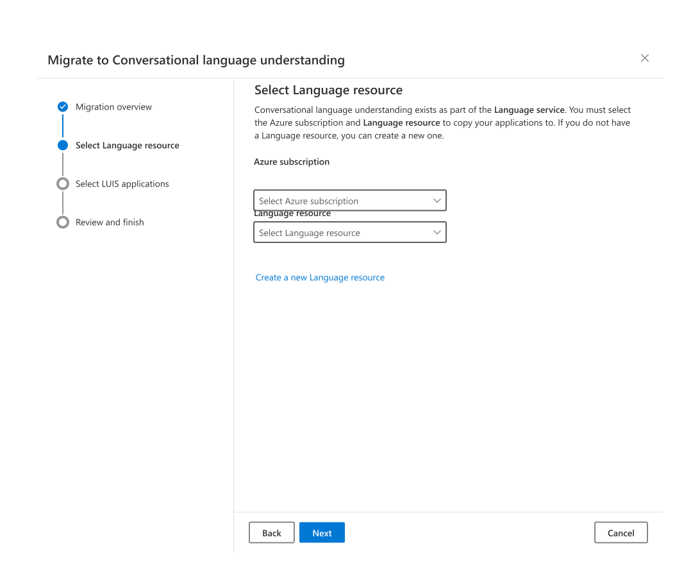
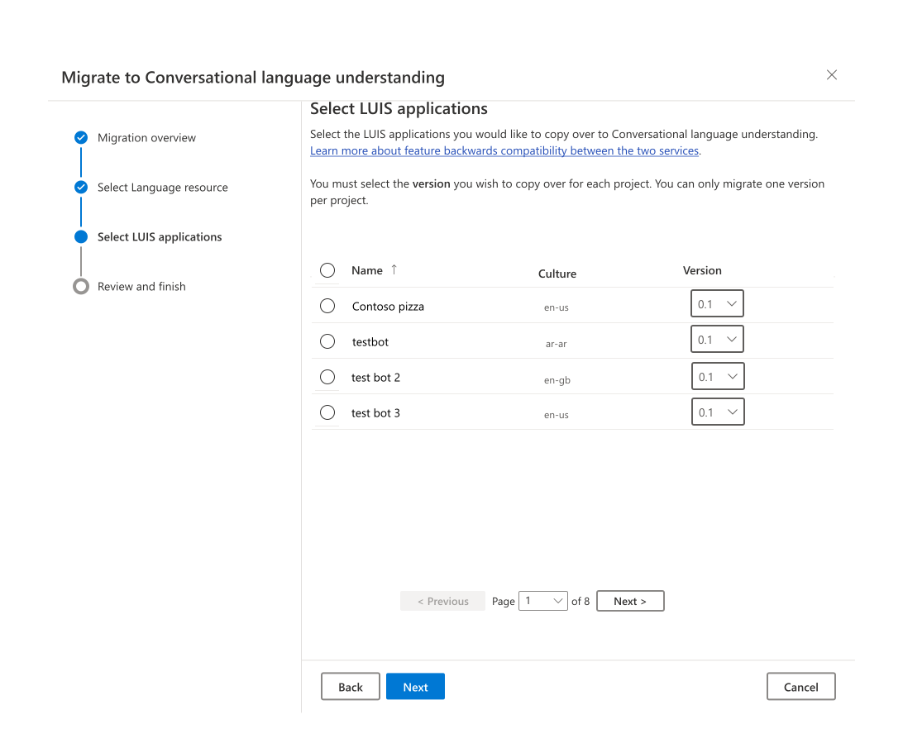
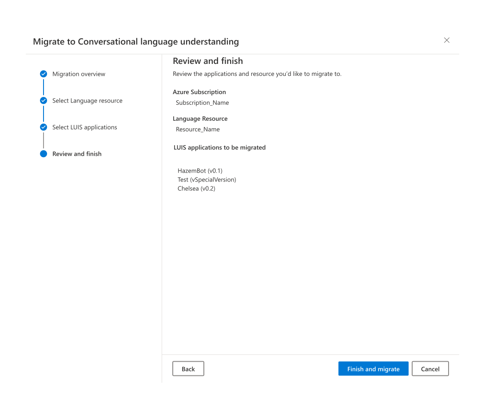
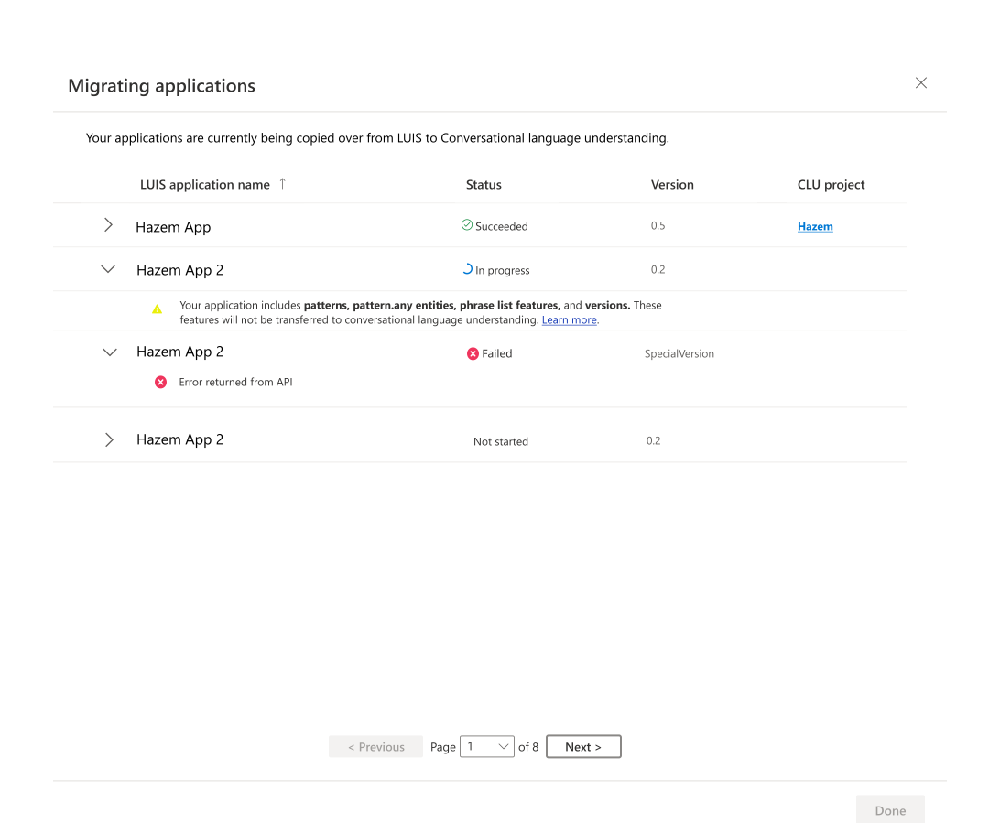

# Migration from Language Understanding (LUIS) to conversational language understanding (CLU)
## Overview
[Conversational language understanding (CLU)](https://docs.microsoft.com/en-us/azure/cognitive-services/language-service/conversational-language-understanding/overview) is a cloud-based AI capability offered by Azure Cognitive Services for Language. It is the newest generation of [Language Understanding (LUIS)](https://docs.microsoft.com/en-us/azure/cognitive-services/luis/what-is-luis) and therefore offers backwards compatibility with previously created LUIS applications. CLU employs state-of-the-art machine-learning intelligence to allow users to build a custom natural language understanding model for the prediction of intents and entities of conversational utterances. 

CLU offers the following advantages over LUIS: 

1. Improved accuracy with state-of-the-art machine learning models for better intent classification and entity extraction. 
2. Multilingual support for model learning and training. 
3. Ease of integration with different CLU and [custom question answering](https://docs.microsoft.com/en-us/azure/cognitive-services/language-service/question-answering/overview) projects using [orchestration workflow](https://docs.microsoft.com/en-us/azure/cognitive-services/language-service/orchestration-workflow/overview), available on the [Language Studio](https://language.cognitive.azure.com/home). 
4. The ability to add testing data easily within the experience using the Language Studio and APIs for model performance evaluation prior to deployment. 

To get started you can [create a new project](https://docs.microsoft.com/en-us/azure/cognitive-services/language-service/conversational-language-understanding/quickstart?pivots=language-studio#create-a-conversational-language-understanding-project) or [migrate your LUIS application](https://github.com/hazemelh/playground/blob/main/luis_to_clu.md#migration-steps-for-your-luis-applications). 

## Comparison between Language Understanding (LUIS) and conversational language understanding (CLU)
The following table presents a side-by-side comparison between the features of LUIS and CLU; additionally, it highlights the changes to your LUIS application after migrating to CLU. You may click on the linked concept to learn more about the changes.

|LUIS features | Conversational language understanding features | Post migration |
|:------------:|:----------------------------------------------:|:--------------:|
|Machine-learned and Structured ML entities| Learned [entity components](#2-how-are-entities-different-in-clu) |Machine-learned entities without sub-entities will be transferred as CLU entities. Structured ML entities will only transfer leaf nodes (lowest level sub-entities without their own sub-entities) will be transferred as entities in CLU. The name of the entity in CLU will be the name of the sub-entity concatenated with the parent _e.g._ _Order.Size_|
|List and Prebuilt entities| List and Prebuilt [entity components](#2-how-are-entities-different-in-clu) | List and Prebuilt entities will be tansferred as entities in CLU with a populated entity component based on the entity type.|
|Regex and Pattern.Any Entities| Regex entities to be available in October 2022 | Pattern.Any entities will be removed. Regex entities will be removed for migrations prior to October 2022.|
|Single culture for each application|[Multilingual model](#4-how-is-conversational-language-understanding-multilingual): multiple languages for each project|The primary language of your project will be set as your LUIS application culture. Your project can be trained to extend to different languages.|
|Entity Roles  |[Roles](#3-how-are-entity-roles-transferred-to-clu) no longer needed | Entity Roles will be transferred as entities.|
|Normalize Punctuation, Normalize Diacritics, Normalize Word Form, Use All Training Data  |[Settings](#6-how-is-the-accuracy-of-clu-better-than-luis) no longer needed |Settings will not be transferred.  |
|Patterns and Phrase list features|[Patterns and Phrase list features](#6-how-is-the-accuracy-of-clu-better-than-luis) no longer needed. |Patterns and Phrase list features will not be transferred.  |
|Entity features| Entity components| List or Prebuilt entities added as features to an entity will be transferred as added components to that entity. [Entity features](https://github.com/hazemelh/playground/blob/main/luis_to_clu.md#16-how-do-entity-features-get-transferred-in-clu) will not be transferred for intents |
|Intents and utterances| Intents and utterances |All intents and utterances will be transferred; utterances will be labeled with their transferred entities. |
|Application GUIDs |Project names| A project will be created for each migrating application with the application name. Any special characters in the application names will be removed in CLU.|
|Versioning| Can only be stored [locally](https://github.com/hazemelh/playground/blob/main/luis_to_clu.md#7-how-do-i-manage-versions-in-clu), will be available in October 2022 | A project will be created for the selected application version. |
|Evaluation using batch testing |Evaluation using testing sets| [Uploading your testing dataset](https://docs.microsoft.com/en-us/azure/cognitive-services/language-service/conversational-language-understanding/how-to/tag-utterances#how-to-label-your-utterances) will be required.|  
|Role-Based Access Control (RBAC) for LUIS resources |Role-Based Access Control (RBAC) available for Language resources |Language resource RBAC must be manually added after migration. [Learn more.](https://docs.microsoft.com/en-us/azure/role-based-access-control/) |
|Single training mode| Standard and advanced [training modes](https://github.com/hazemelh/playground/blob/main/luis_to_clu.md#14-how-are-the-training-times-different-in-clu) | Training will be required after application migration. |
|Two publishing slots and version publishing |Ten deployment slots with custom naming|Deployment will be required after the application’s migration and training. |
|LUIS Authoring APIs and SDK support in .NET, Python, Java, and Node.js |[CLU Authoring APIs](https://docs.microsoft.com/en-us/rest/api/language/conversational-analysis-authoring); SDK support will be available in October 2022| Learn more on how to use the [CLU authoring APIs](https://docs.microsoft.com/en-us/azure/cognitive-services/language-service/conversational-language-understanding/quickstart?pivots=rest-api). [Refactoring](#13-do-i-have-to-refactor-my-code-if-i-migrate-my-applications-from-luis-to-clu) will be necessary to use the CLU authoring APIs. |
|LUIS Runtime APIs and SDK support in .NET, Python, Java, and Node.js |[CLU Runtime APIs](https://docs.microsoft.com/en-us/rest/api/language/conversation-analysis-runtime); CLU Runtime SDK support in [.NET](https://docs.microsoft.com/en-us/dotnet/api/overview/azure/ai.language.conversations-readme-pre?view=azure-dotnet-preview&preserve-view=true) and [Python](https://docs.microsoft.com/en-us/python/api/overview/azure/ai-language-conversations-readme?view=azure-python-preview&preserve-view=true). Node.js SDK support to be available October 2022.| Learn more on how to use the [CLU runtime SDKs](https://docs.microsoft.com/en-us/dotnet/api/overview/azure/ai.language.conversations-readme-pre?view=azure-dotnet-preview&preserve-view=true) and [APIs](https://docs.microsoft.com/en-us/azure/cognitive-services/language-service/conversational-language-understanding/how-to/call-api?tabs=REST-APIs). [Refactoring](#13-do-i-have-to-refactor-my-code-if-i-migrate-my-applications-from-luis-to-clu) will be necessary to use the CLU runtime API response. |

## Migrate your LUIS applications using LUIS Portal
Follow these steps to begin migration using the [LUIS Portal](https://www.luis.ai/): 

1. After logging into luis.ai, click the button on the banner, shown below, to launch the migration wizard. Please note that migration will only copy your selected LUIS applications to CLU. 


2. The migration overview tab, shown below, provides a brief explanation of conversational language understanding and its benefits. Press Next to proceed.  


3. The next step is to determine the Language resource that you wish to migrate your LUIS application to. If you have already created your Language resource, proceed by first selecting your Azure subscription followed by your Language resource and then press Next, highlighted in the figure below. If you have not previously created your Language resource, click the link to Create a new Language resource, follow the guide. Afterwards, select your options as previously mentioned then press Next. 





4. Select all your LUIS applications that you wish to migrate as well as specify each of their versions and then press Next. Note that special characters are not supported by Conversational language understanding. Any special characters in your selected LUIS application names will be removed in the newly created CLU applications. After selecting your application and version, you will be prompted with a message informing you of any features your LUIS application has that will not be carried over, as shown in the figure below. 





5. Once you have completed all the steps (1-4), you can review your Language resource and LUIS applications selections. Press Finish and migrate once you have completed your review. 





7. A popup window, shown below, will allow you to track the migration status of your applications. Applications that have not started migrating will have a status of “Not started”. Applications that have begun migrating will have a status of “In progress” and once they have finished migrating their status will be converted to “Succeeded”. An application status that returns “Failed” means that you must repeat its migration process following steps (1-5). Once the migration has completed for all applications, press Done to move on to Next Steps.





8. Next steps: 

   * [Train your model](https://docs.microsoft.com/en-us/azure/cognitive-services/language-service/conversational-language-understanding/how-to/train-model?tabs=language-studio) 
   
   * [Deploy your model](https://docs.microsoft.com/en-us/azure/cognitive-services/language-service/conversational-language-understanding/how-to/deploy-model?tabs=language-studio) 
   
   * [Call your deployed model](https://docs.microsoft.com/en-us/azure/cognitive-services/language-service/conversational-language-understanding/how-to/call-api?tabs=language-studio)  

## Migrate your LUIS applications using REST APIs
Follow these steps to begin migration programmatically using the CLU Authoring REST APIs: 

1. Export your LUIS application in JSON format. You can use the [LUIS Portal](https://www.luis.ai/) to export your applications or via the [LUIS Programmatic APIs](https://westus.dev.cognitive.microsoft.com/docs/services/luis-programmatic-apis-v3-0-preview/operations/5890b47c39e2bb052c5b9c40).  

2. Import your LUIS application by submitting a POST request using the following URL, headers, and JSON body to import LUIS application into your CLU project. Please note that CLU does not support names with special characters so please remove any special characters from the Project Name.

### Request URL
```rest
{ENDPOINT}/language/authoring/analyze-conversations/projects/{PROJECT-NAME}/:import?api-version={API-VERSION}&format=luis
```

|Placeholder  |Value  | Example |
|---------|---------|---------|
|`{ENDPOINT}`     | The endpoint for authenticating your API request.   | `https://<your-custom-subdomain>.cognitiveservices.azure.com` |
|`{PROJECT-NAME}`     | The name for your project. This value is case-sensitive.   | `myProject` |
|`{API-VERSION}`     | The version of the API you are calling. The value referenced here is for the latest released [model version](../../../concepts/model-lifecycle.md#choose-the-model-version-used-on-your-data) released.  | `2022-05-01` |
  
### Headers
Use the following header to authenticate your request.
  
|Key|Value|
|--|--|
|`Ocp-Apim-Subscription-Key`| The key to your resource. Used for authenticating your API requests.|

### Body
Use the exported LUIS JSON data as your body.

3. Next steps: 
   * [Train your model](https://docs.microsoft.com/en-us/azure/cognitive-services/language-service/conversational-language-understanding/how-to/train-model?tabs=language-studio) 
   
   * [Deploy your model](https://docs.microsoft.com/en-us/azure/cognitive-services/language-service/conversational-language-understanding/how-to/deploy-model?tabs=language-studio) 
   
   * [Call your deployed model](https://docs.microsoft.com/en-us/azure/cognitive-services/language-service/conversational-language-understanding/how-to/call-api?tabs=language-studio)  

## Frequently asked questions
   
### 1. Which LUIS JSON version is supported by CLU? 

CLU supports the model JSON version 7.0.0. If the JSON format is older, it would need to be imported first, then exported from LUIS with the most recent version.  

### 2. How are entities different in CLU? 

In CLU, a single entity can have multiple entity components which are different methods for extraction. Those components are then combined together using some rules you can define. The available components are Learned (equivalent to ML entities in LUIS), List, and Prebuilt. Regex components will be available October 2022. 

After migrating, your structured ML leaf nodes, bottom-level sub-entities, will be transferred over to the new CLU model while all the parent entities, higher-level entities, will be ignored. The name of the entity will be the bottom-level entity’s name concatenated with its parent entity. 

#### Example: 

LUIS entity: 

* Pizza Order  

   * Topping  

   * Size  

Migrated LUIS entity in CLU: 

* Pizza Order.Topping 

* Pizza Order.Size 
  
For more information on entity components, click [here](https://docs.microsoft.com/en-us/azure/cognitive-services/language-service/conversational-language-understanding/concepts/entity-components).

### 3. How are entity roles transferred to CLU? 

Your roles will be transferred as distinct entities along with their labeled utterances; each role’s entity type will determine which entity component will be populated. For example, a list entity role will be transferred as an entity with the same name as the role, with a populated list component. 

### 4. How is conversational language understanding multilingual? 

Conversational language understanding projects accept utterances in different languages. Furthermore, you can train your model in one language and extend it to predict in other languages.  

#### Example:  

Training utterance (English):  How are you? 

Labeled intent: Greeting 

Runtime utterance (French): Comment ça va? 

Predicted intent: Greeting 

### 5. How are entity confidence scores different in CLU? 

Any extracted entity has a 100% confidence score and therefore entity confidence scores should not be used to make decisions between entities.  

### 6. How is the accuracy of CLU better than LUIS? 

CLU uses state-of-the-art models to enhance the ML performance of the different models of intent classification and entity extraction. 

These models are insensitive to minor variations which removes the need for Normalize Punctuation, Normalize Diacritics, Normalize Word Form and Use All Training Data settings.  

Additionally, the new models do not support phrase list features as they no longer require supplementary information from the user to provide semantically similar words for better accuracy. Patterns were also used to provide improved intent classification using rule-based matching techniques that are not necessary in the new model paradigm.

### 7. How do I manage versions in CLU? 

Although CLU does not offer versioning, you can export your CLU projects using the [Language Studio](https://language.cognitive.azure.com/home) or [programmatically](https://docs.microsoft.com/en-us/azure/cognitive-services/language-service/conversational-language-understanding/how-to/fail-over#export-your-primary-project-assets) and store different versions of the assets locally. Versioning will be coming to CLU in October 2022. 

### 8. Why is CLU classification different from LUIS? How does None classification work? 

CLU presents a different approach to training the models where it uses multi-classification as opposed to binary classification. As a result, the interpretation of the scores is different and also differs across the training options. While you are likely to achieve better results, you have to observe the difference in scores and determine a new threshold for accepting the intent predictions. You can easily add a confidence score threshold for [None](https://docs.microsoft.com/en-us/azure/cognitive-services/language-service/conversational-language-understanding/concepts/none-intent) in your project settings. This will return the top intent as None if the top intent did not exceed the confidence score threshold provided. 

### 9. Do I need more data for CLU models than LUIS? 

The new CLU models have better semantic understanding of language than in LUIS, and in turn would help make models generalize with a significant reduction of data. While you shouldn’t be aiming to reduce the amount of data that you have, you should, however, expect better performance and resilience to variations and synonyms in CLU compared to LUIS. 

### 10. If I don’t migrate my LUIS apps, will they be deleted? 

Microsoft is committed to providing continual support for your existing LUIS applications until 1 October 2025; then, you will no longer be able to use those applications and the service endpoints will no longer function, and the applications will be permanently deleted. 

### 11. Are .LU files supported on CLU? 

Only JSON format is supported by CLU. You can import your .LU files to LUIS and export them in JSON format or you can follow the previously mentioned migration steps for your application. 

### 12. What are the service limits of CLU? 

CLU limitations can be found [here](https://docs.microsoft.com/en-us/azure/cognitive-services/language-service/conversational-language-understanding/service-limits). 

### 13. Do I have to refactor my code if I migrate my applications from LUIS to CLU? 

The API objects of CLU applications are different from LUIS and therefore code refactoring will be necessary.  

If you are using the LUIS [Programmatic](https://westus.dev.cognitive.microsoft.com/docs/services/luis-programmatic-apis-v3-0-preview/operations/5890b47c39e2bb052c5b9c40) and [Runtime](https://westus.dev.cognitive.microsoft.com/docs/services/luis-endpoint-api-v3-0/operations/5cb0a9459a1fe8fa44c28dd8) APIs, you can easily replace them with their equivalent APIs. 

[CLU authoring APIs](https://docs.microsoft.com/en-us/rest/api/language/conversational-analysis-authoring): Note that as opposed to specific CRUD APIs available in LUIS for individual actions such as add utterance, delete entity, rename intent, CLU offers an [import API](https://docs.microsoft.com/en-us/rest/api/language/conversational-analysis-authoring/import) that simply replaces the full content of a project using the same name. If your service used LUIS Programmatic APIs to provide a platform for other customers, you must consider this new design paradigm. All other APIs such as listing projects, training, deploying, and deleting are available. APIs such as importing and deploying are asynchronous operations instead of synchronous as they were in LUIS. 

[CLU runtime APIs](https://docs.microsoft.com/en-us/rest/api/language/conversation-analysis-runtime/analyze-conversation): The new API request and response includes a lot of the same parameters such as query, prediction, top intent, intents, entities, and their values. The CLU response object offers a more straight forward approach where entity predictions are provided as they are in the utterance text, and any additional information such as resolution or list keys are provided in extra parameters called extraInformation and resolution. You can learn more about the [API response structure here](https://docs.microsoft.com/en-us/rest/api/language/conversation-analysis-runtime/analyze-conversation). 

You can use the [.NET](https://github.com/Azure/azure-sdk-for-net/tree/Azure.AI.Language.Conversations_1.0.0-beta.3/sdk/cognitivelanguage/Azure.AI.Language.Conversations/samples/) or [Python](https://github.com/Azure/azure-sdk-for-python/blob/azure-ai-language-conversations_1.1.0b1/sdk/cognitivelanguage/azure-ai-language-conversations/samples/README.md) CLU Runtime SDK to replace the LUIS Runtime SDK. There is currently no authoring SDK available for CLU. 

### 14. How are the training times different in CLU? 

CLU offers Standard Training which trains and learns in English in a short duration that is comparable to the training time of LUIS. It also offers Advanced Training which takes a considerably longer duration as it extends the training to all other supported languages. 

### 15. How can I link sub-entities to parent entities from my LUIS application in CLU? 

One simple way to implement the concept of sub-entities in CLU is to combine the sub-entities into different entity components within the same entity.  

#### Example: 

LUIS Implementation: 

* Pizza Order (entity)  

   * Size (sub-entity) 

   * Quantity (sub-entity) 

CLU Implementation: 

* Pizza Order (entity) 

   * Size (list entity component: small, medium, large) 

   * Quantity (prebuilt entity component: number) 

In CLU, you would label the entire span for Pizza Order inclusive of the size and quantity, which would return the Pizza Order with a list key for Size, and a number value for Quantity in the same entity object. 

For more complex problems where entities contain several levels of depth, you can create a project for each couple of levels of depth in the entity structure. This gives you the option to pass the utterance to each project and combine the analyses of each and combine them in the stage proceeding CLU. For a detailed example on this concept, check out the pizza bot sample available in the samples folder of this [repository](https://github.com/Azure-Samples/cognitive-service-language-samples).

### 16. How do entity features get transferred in CLU? 

Entities used as features to intents will not be transferred. Entities used as features for other entities will populate the relevant component of the entity. For example, if a list entity SizeList was used as a feature to a machine-learned entity Size, then the Size entity will be transferred to CLU with the list values from SizeList added to its list component. 

### 17. How will my LUIS applications be named in CLU after migration?

Any special characters in the LUIS application name will be removed. If the cleared name length is greater than 50 characters, the extra characters will be removed. If the name after removing special characters is empty (ex: if the LUIS application name was @@), the new name will be untitled. If there is already a conversational language understanding project with the same name, the migrated LUIS application will be appended with "_1" for the first duplicate and increasing by 1 for each additional duplicate. In case the new name’s length is 50 characters and it needs to be renamed, the last 1 or 2 characters will be removed to be able to concatenate the _count and still be within the 50 characters limit. 

## Migration from LUIS Q&A

If you have any questions that were unanswered in this article be sure leave your questions at our [Q&A](https://aka.ms/luis-migration-qna-thread) thread. 

